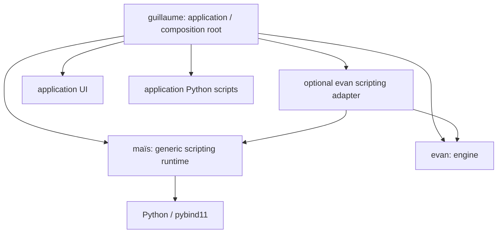
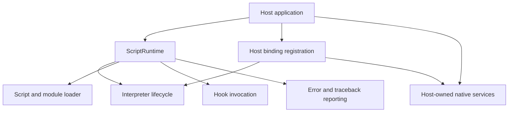

# maïs Architecture

maïs is a reusable C++ scripting runtime, initially embedding Python with pybind11. It provides generic script execution services without depending on an application, an engine, a renderer, or a UI framework. `guillaume` is the first intended consumer; `evan` can be exposed through an adapter owned by the consumer or by a separate integration package.

> This document specifies the target architecture. Module names and method signatures are illustrative until confirmed against the repository implementation.

## Dependency layout



The arrows indicate compile-time or composition dependencies, not ownership. maïs must build and pass tests without `evan` or `guillaume`. `evan` must remain usable without Python. The adapter belongs in `guillaume` initially; move it to a separate package only if another consumer needs it.

## Runtime modules



- **ScriptRuntime** is the host-facing entry point for starting/stopping scripting, locating scripts, and invoking hooks. Its exact API is to be defined during implementation.
- **Interpreter lifecycle** enforces explicit, process-aware Python initialization and finalization. The first implementation should define one owner rather than implicitly supporting multiple runtimes.
- **Script and module loader** manages application-supplied script paths and imports; maïs does not ship `guillaume` scripts.
- **Hook invocation** runs named Python functions at points chosen by the host and returns results or actionable errors.
- **Diagnostics** captures Python exceptions with traceback information for host logs or UI display. It does not require a UI toolkit.
- **Host binding registration** provides a way for consumers to expose selected C++ objects. Its implementation must respect pybind11's embedded-module registration timing.

These are responsibilities, not a requirement to create one C++ class per box. Keep public headers small and avoid leaking pybind11 types unless the host-facing contract needs them.

## Ownership boundaries

```text
Host owns: engine, configuration, application loop, UI, application scripts.
maïs owns: its interpreter lifecycle and its own Python references.
Adapter owns: binding definitions, not the host's engine instance.
Python sees: narrowly exposed host objects with documented lifetimes.
```

The host must create the engine only once. Bindings can reference that host-owned instance or a facade; they should not let `Engine()` in Python silently create a second one. The engine and other injected native objects must outlive all Python wrappers that refer to them. Release Python callbacks and wrappers before interpreter finalization. Document GIL ownership and the thread on which callbacks execute.

An abstract `IEngine` is not required in maïs for the `evan` integration. Introduce an engine-neutral contract only if more than one actual integration demonstrates a common need; otherwise keep adaptation at the boundary.

## Application lifecycle

The application, not Python, controls startup and the frame loop:

```mermaid
sequenceDiagram
    participant Host as guillaume / other host
    participant Adapter as optional evan adapter
    participant Runtime as maïs runtime
    participant Python as Python scripts
    participant Engine as evan / native service

    Host->>Engine: create engine and configuration
    Host->>Adapter: prepare bindings for host-owned objects
    Host->>Runtime: register bindings before interpreter startup
    Host->>Runtime: start interpreter; add script paths
    Host->>Runtime: invoke configure(config)
    Runtime->>Python: configure(config)
    Python-->>Runtime: proposed settings
    Runtime-->>Host: result or traceback
    Host->>Host: validate settings
    Host->>Engine: apply settings; initialize
    Host->>Runtime: invoke on_start(context)
    loop each host-controlled frame
        Host->>Engine: process/update/render
        Host->>Runtime: invoke on_update(context, dt) at chosen point
        Runtime->>Python: on_update(context, dt)
    end
    Host->>Runtime: invoke on_shutdown(context)
    Host->>Runtime: release references; stop interpreter
    Host->>Engine: destroy engine
```

The names `configure`, `on_start`, `on_update`, and `on_shutdown` are example host-defined hooks, not a promise that they already exist. The exact position of `on_update` relative to engine updates and rendering must be specified by each consumer. Script errors should reach the host with traceback context and an explicit policy for continuing or stopping.

## Engine integration

`evan` should provide native configuration at the appropriate point in its lifecycle. The optional adapter translates a restricted subset of that API into Python-visible settings or commands. The host validates configuration before engine initialization and retains ownership of the loop. Runtime changes, if supported later, need separate thread and lifecycle rules.

The adapter can live alongside `guillaume` at first. If extracted into `evan-scripting`, its allowed dependency direction is `evan-scripting → maïs + evan`; neither maïs nor evan links back to it.

## UI boundary

maïs does not contain `Panel`, `Button`, `Console`, `EngineSettings`, or `SceneViewport` implementations. A consumer may build these on top of its own controller/model and use maïs diagnostics to populate a script console. Select Qt/QML, ImGui, or another toolkit only after inspecting the actual window and renderer ownership. A scene viewport requires real rendering integration, not just a placeholder widget.

## Build and test strategy

- Build maïs independently, with only its generic scripting dependencies.
- Test interpreter startup/shutdown, script loading, host object injection, callback invocation, Python tracebacks, and object lifetimes against fake services.
- Export a reusable CMake target if external projects need to install and consume the library; verify it with a separate test application.
- Keep engine adapters and consumer scripts out of the core target.
- Do not introduce the old renderer project's GLFW/OpenXR/Vulkan platform matrix into maïs. Support for particular operating systems and Python versions should be documented only after validation.

## Design goal

Make Python scripting reusable across applications without turning maïs into an engine framework. The application controls native state and scheduling; maïs supplies a predictable, testable scripting boundary.
