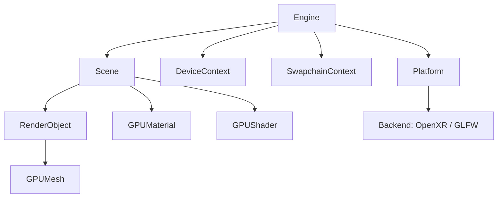
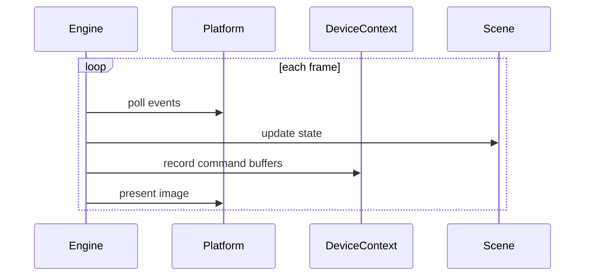

# Mais Architecture

Mais is split into a small set of runtime layers so rendering code, platform
code, and scene logic stay separated.

## Module Layout

- **Engine** owns the frame loop and coordinates update, draw, and present.
- **Platform** abstracts the target backend (OpenXR or GLFW) and platform.
- **Device & swapchain** manage Vulkan resources and frame ownership.
- **Scene** holds renderable objects, meshes, and materials.

## Frame Lifecycle

## Build Variants

- `BUILD_FOR_GLFW` enables desktop platform support.
- `BUILD_FOR_OPENXR` enables XR support.
- Android-specific paths are enabled when the selected platform is Android.

## Design Goal

Keep the engine low-level enough for performance while still exposing a
straightforward application lifecycle to the higher layers.
