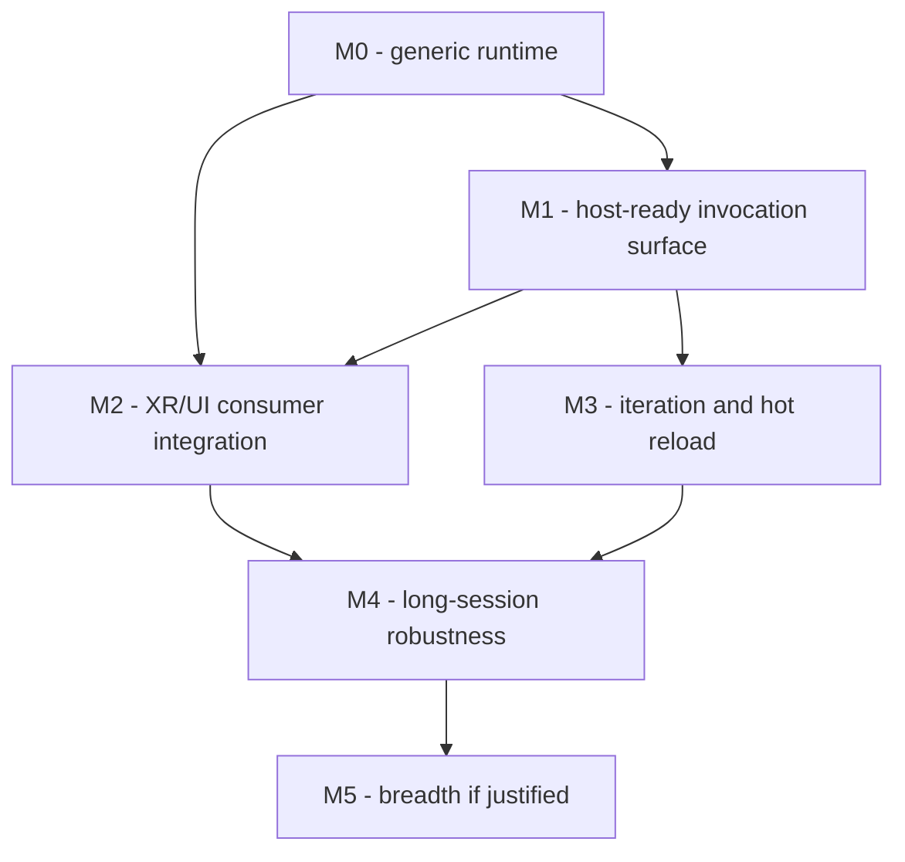

# maïs Roadmap

This roadmap covers the scripting runtime **maïs** in the context of its first
consumer: an XR/UI application (`guillaume`) built on the `evan` engine.

Scope note, because it shapes every item below: `AGENTS.md` states that maïs owns
generic interpreter lifecycle, script loading and invocation, binding
registration, and error reporting — and **not** the XR session, the renderer, the
window, the frame loop, or UI widgets. XR/UI is therefore the *driver* for this
roadmap, not the contents of the library. Items that belong to the consumer are
tracked here anyway, marked with their real owner, so the sequencing is visible
in one place. For the ordered increments and the work items themselves, see
[`MILESTONES.md`](MILESTONES.md) and the [`issues/`](issues/) backlog.

## How to read this

- **Owner** — which component must implement the item. Only `maïs` items may
  change this repository.
- **Status** — `Done`, `Next`, `Later`, `Blocked`, `Conditional`.
- Items are identified as `MAIS-`, `HOST-`, `ADAPTER-`, or `ENGINE-` so a
  dependency on another repository is impossible to miss.
- Every item that changes the public API needs maintainer approval, per
  `AGENTS.md`. Public API changes also require a `CHANGELOG.md` entry.

## Where the project is today — Milestone 0

Verified by a clean configure, build, and test run:

| Capability | Evidence |
| --- | --- |
| Interpreter ownership and lifecycle, single owner per process | `initialize()` / `shutdown()`, eight lifecycle tests including three sequential restarts |
| Host binding registration for embedded modules | `registerModule()` + `PythonModule`; fake-host test injects a native service and Python mutates it |
| Script discovery, loading, invocation | Validated search paths, `loadModule()`, `call()` / `callOptional()` |
| Python error reporting with tracebacks | `Error` carries the message and a `traceback.format_exception()` render |
| Standalone host with no engine or UI | `examples/standalone_host`, also registered as a CTest |
| Consumability | Installed package, `find_package(mais)`, `mais::mais`; verified from a separate project |
| Guardrails | 32 tests, benchmark harness, Doxygen target, formatter check, ASan/coverage CI |

## Ownership boundary

| Concern | Owner | Not in maïs |
| --- | --- | --- |
| Interpreter lifecycle, loading, invocation, diagnostics | **maïs** | |
| Binding definitions for engine/app objects | **guillaume** or an `evan-scripting` adapter | maïs must not ship them |
| Engine configuration, windowing, rendering, XR session | **evan** | |
| Application loop and hook scheduling | **guillaume** | |
| UI widgets — `Panel`, `Button`, `Text`, `Input`, `Console`, `EngineSettings` | **guillaume** | maïs exposes diagnostics, never widgets |
| `SceneViewport` | **guillaume**, once renderer/window ownership is known | explicitly deferred |

## Milestones at a glance

| Milestone | Goal | Owner | Status |
| --- | --- | --- | --- |
| **M0** | Generic runtime that a host can embed | maïs | Done |
| **M1** | Invocation surface rich enough for a real XR/UI host | maïs | Next |
| **M2** | Wire the runtime into the XR/UI application | guillaume + adapter | Next |
| **M3** | Fast iteration: reload scripts without restarting the headset app | maïs, design-first | Later |
| **M4** | Survive long XR sessions: threads, memory, failure policy, trust | maïs | Later |
| **M5** | Breadth, only if a second real consumer justifies it | maïs | Conditional |



---

## M1 — Host-ready invocation surface

*Why now:* the MVP passes scalars and expects scripts to reach native objects
through `import host`. That is enough for the acceptance test but not for the
XR/UI host, which wants to hand a configuration facade and a per-frame context
straight to a hook and read values back.

| ID | Item | Why, in XR/UI terms | Status |
| --- | --- | --- | --- |
| MAIS-1.1 | **Host object arguments.** Let a hook receive a native object, so `configure(config)` and `on_update(context, dt)` work as sketched in `ARCHITECTURE.md`. Needs a deliberate design that keeps pybind11 out of the public headers. | The settings facade and the frame context are the natural way for scripts to read and propose state. | Next |
| MAIS-1.2 | **Typed return values.** A `Result<T>` / optional-returning call, instead of discarding everything a script returns. | A script asking to change scene, request quit, or return metrics. | Next |
| MAIS-1.3 | **Hook introspection.** `hasFunction()` and a function listing, without invoking. | The console and settings panel list the hooks a script implements; avoids double-invoking optional hooks. | Next |
| MAIS-1.4 | **Per-hook call policy.** Continue/stop, warn-once, and per-hook timing. | One broken `on_update` must not kill a running session; the UI shows which hook is slow. | Next |
| MAIS-1.5 | **Structured diagnostics.** Traceback frames as data — file, line, function — not only formatted text. | A console can only jump to source if it gets frames, not a string. | Next |
| MAIS-1.6 | **Explicit module lifecycle.** `reloadModule()`, `unloadModule()`, and documented re-import semantics. | Precursor to M3; also lets a host disable a bad script at runtime. | Later |
| MAIS-1.7 | **Decide and document the GIL/threading model.** Either the current "hold the GIL on the initializing thread" or a release/attach mode. | `evan` may want scripts callable from a render or worker thread. Decide before M2 hardens. | Next |
| MAIS-1.8 | **Support matrix.** CI across Python 3.11–3.13 and all three desktop OSes; state the floor and ceiling. | First-class Windows support is currently unverified on real hardware. | Next |
| MAIS-1.9 | **API freeze review** and complete API-reference coverage before `1.0.0` is tagged. | Consumers should not build on a moving surface. | Later |

**Exit criteria:** a host can pass a native facade to a hook, read a typed result
back, list a module's hooks, see per-hook timing, and render a traceback as
clickable frames — with tests for each.

## M2 — XR/UI consumer integration

*Owner: `guillaume` and the optional `evan-scripting` adapter. This milestone must
not add engine or UI code to maïs.*

| ID | Item | Notes | Status |
| --- | --- | --- | --- |
| ADAPTER-2.1 | `evan-scripting` adapter exposing a **narrow** configuration facade. | Depends on maïs + evan; neither depends on it. No `IEngine` in maïs. | Next |
| ADAPTER-2.2 | Validate script-proposed settings, then apply before engine init. | The MVP example already demonstrates the pattern with `HostSettings`. | Next |
| HOST-2.3 | Document and implement the hook schedule at exact loop points, relative to engine update and render, respecting XR frame pacing. | `ARCHITECTURE.md` requires each consumer to specify this. | Next |
| HOST-2.4 | Script console fed by maïs diagnostics, with frame-to-source navigation. | Depends on MAIS-1.5. | Later |
| HOST-2.5 | `EngineSettings` panel bound to the same facade; UI components live here. | Never in maïs. | Later |
| HOST-2.6 | Script packaging: dev versus shipped layout and resolution order. | maïs only resolves paths it is given. | Next |
| HOST-2.7 | `SceneViewport`. | Blocked on renderer/window ownership being settled. | Blocked |

**Exit criteria:** a script configures the engine through a validated facade, its
hooks run at documented points in the XR frame, and its errors appear in the
application console — with maïs unchanged except as M1 requires.

## M3 — Iteration and hot reload

*Design before code.* `TECHNICAL_CHOICES.md` lists hot reload as a deferred
decision requiring explicit requirements, tests, and ownership rules.

| ID | Item | Notes | Status |
| --- | --- | --- | --- |
| MAIS-3.1 | Design document: requirements, ownership, failure modes, what state may be migrated. | Gate for everything below. | Later |
| MAIS-3.2 | Change detection and reload that does not stall a frame; budgeted, observable. | Iterating on an XR app should not mean a headset restart. | Later |
| MAIS-3.3 | State migration contract: explicit, opt-in, schema-checked. | Silent state loss is worse than no reload. | Later |
| MAIS-3.4 | Reference invalidation: old module objects are released before re-execution; no dangling native wrappers. | Interacts with the lifetime contract. | Later |

**Exit criteria:** a script can be edited and reloaded mid-session, repeatedly,
without leaks, without invalidating host objects, and without dropping frames
beyond the documented budget.

## M4 — Long-session robustness

*XR sessions run for hours, unattended, on constrained hardware.*

| ID | Item | Notes | Status |
| --- | --- | --- | --- |
| MAIS-4.1 | Cross-thread callback dispatch, if MAIS-1.7 shows it is needed. | Requires an explicit queue and lifetime model, not ad-hoc GIL grabs. | Later |
| MAIS-4.2 | Memory verification: reference cycles, bounded caches, leak checks under ASan/Valgrind across many reloads. | See the `ASAN_OPTIONS` note in `sanitizers.yml`. | Later |
| MAIS-4.3 | Failure policy: error budgets, disable-a-failing-module, no uninformative Booleans. | A bad script should degrade, not crash the session. | Later |
| MAIS-4.4 | Trust model and sandboxing, if scripts can be user-authored. | Threat model first; sandboxing is a design, not a flag. | Conditional |
| MAIS-4.5 | Subinterpreters / multi-tenancy. | Only with a stated requirement. | Conditional |
| MAIS-4.6 | Crash-safe diagnostics: write failures to a log without needing a UI. | The UI may be the thing that crashed. | Later |

## M5 — Breadth

| ID | Item | Gate | Status |
| --- | --- | --- | --- |
| MAIS-5.1 | A second scripting language behind a language-neutral seam. | A real second consumer must exist; a single consumer must not shape the seam. | Conditional |
| MAIS-5.2 | Multi-consumer packaging validation with more than one host application. | | Conditional |

## Explicitly out of scope for maïs

XR session and reference-space management; Vulkan or any rendering; windowing;
frame pacing; UI widgets including `Panel`, `Button`, `Text`, `Input`, `Console`,
`EngineSettings`, and `SceneViewport`; interpreting engine settings; the
application main loop; a Python-side `Engine()` constructor; the one-platform /
one-backend build matrix; and choosing Qt/QML, ImGui, or another UI toolkit on a
consumer's behalf.

## Open questions

| # | Question | Blocks | Owner |
| --- | --- | --- | --- |
| Q1 | Does `guillaume` need native objects passed to hooks, or is `import host` sufficient? | MAIS-1.1 priority | guillaume |
| Q2 | Which UI toolkit hosts the console and settings panel? | HOST-2.4, HOST-2.5 | guillaume |
| Q3 | Hot reload scope: module re-import, subinterpreter per script, or process swap? | M3 | maintainers |
| Q4 | Are scripts first-party only, or user-authored? | MAIS-4.4 | product |
| Q5 | Must scripts ever run off the main thread? | MAIS-1.7, MAIS-4.1 | evan + guillaume |
| Q6 | Python floor and ceiling; is Windows first-class? | MAIS-1.8 | maintainers |
| Q7 | Is there a sponsor for a second scripting language? | MAIS-5.1 | maintainers |
| Q8 | One runtime per process forever, or eventually several? | MAIS-4.5 | maintainers |

## Verification gates

Every milestone must keep these green; the commands are the ones the repository
actually documents.

```sh
cmake -S . -B build -DCMAKE_BUILD_TYPE=Debug \
  -DPython_EXECUTABLE="$(command -v python3)"
cmake --build build
ctest --test-dir build --output-on-failure
bash scripts/run-clang-format.sh   # CI checks git diff --exit-code
```

Additional gates by milestone:

- **M1** — new tests for object arguments, typed returns, introspection, per-hook
  policy, and structured frames; API-reference coverage for each new symbol.
- **M2** — the standalone example is extended or a second host example proves the
  consumer story without adding engine or UI code to maïs.
- **M3** — a reload test that loops many times under ASan, plus a frame-budget
  test.
- **M4** — a long-running soak test; leak checks; failure-policy tests.
- **M5** — an external consumer build, as already done for `find_package(mais)`.

## Cross-cutting rules

- maïs stays independent of `guillaume`, `evan`, and any UI toolkit; `evan` stays
  usable without Python.
- Nothing consumer-specific enters `headers/mais/`.
- Public headers keep pybind11 out of the compile interface.
- Engine configuration is validated by the host, never interpreted by maïs.
- Deferred items (`TECHNICAL_CHOICES.md`) stay deferred until they have explicit
  requirements, tests, and ownership rules.
